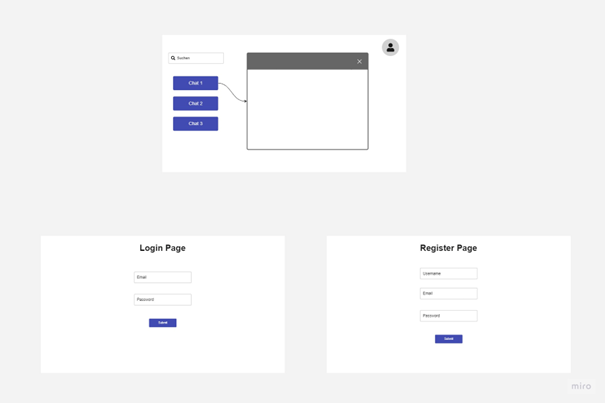
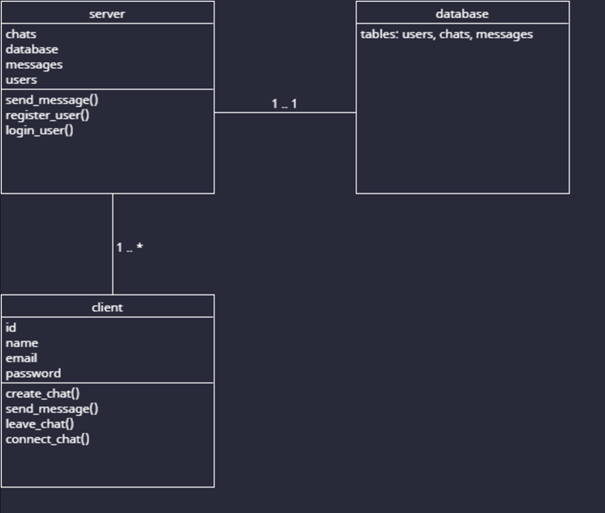
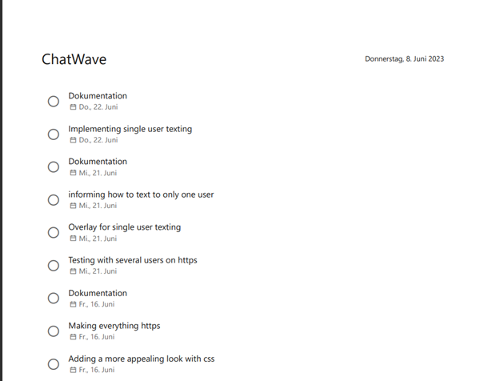
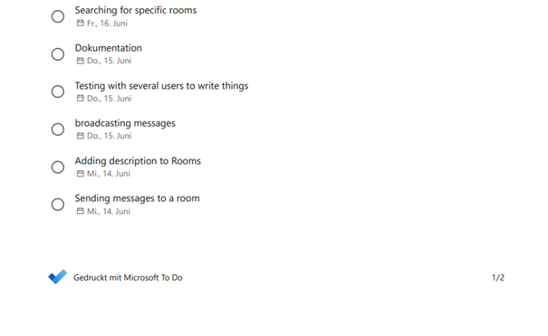
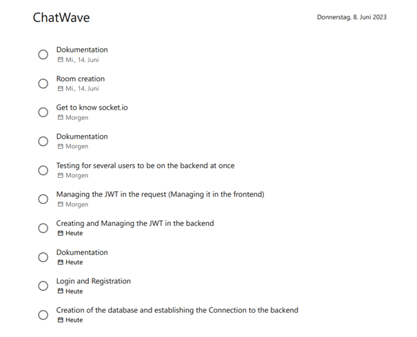

# Planung

## Beschreibung der Idee, (inkl. Regeln, auch bei bekannten Spielen)

Meine Idee war es eine Art Chat App zu machen. Da habe ich
zuerst an Discord oder Whatsapp gedacht, aber ich denke ich werde etwas anderes
machen. Meine Idee war es eine Room-basierte Chat App zu machen, also dass
andere Leute oder man selbst einfach ein Room erstellen kann und dann kann man
diesem Joinen und mit anderen Leuten chatten. Die Idee ist aber, dass die Rooms
bestehen bleiben und man diese auch nach ein paar Monaten wieder hat. Das ist
bis jetzt die Grundidee. Weitere Ideen, um dieses zu erweitern ist, dass Rooms
eine Beschreibung und auch Tags haben können. Verschiedenste Voice Channels
wären auch noch eine Idee für die Zukunft.

## Beschreibung der Use Cases, wer kann was machen (wo möglich inkl. Diagramm)

Logged out User:

1. Können nichts machen müssen sich einloggen

Logged in User:

1. Können Rooms erstellen
2. Können anderen Rooms beitreten
3. Können in den beigetretenen Rooms chatten
4. Können eine Room Beschreibung machen

## Beschreibung von allfälligen Risiken

1. Datenschutz (da wir nur 6 – Tage Zeit haben ist
   der Datenschutz eine schwierige Sache).
2. Zeit (Ich weiss nicht genau wie viel Zeit ich brauchen werde für die verschiedenen Dinge, weil ich viele neue Technologienanwenden muss)

## Konzept für das UI mit Wireframes oder Mockups und Flow-Chart

## Konzept für die Umsetzung in Form eines Klassendiagramms, Struktur der Applikation, Files

## Aufstellung der verwendeten Technologien und Tools die Sie einsetzen werden

1. Vscode
2. Socket.io
3. Node JS
4. HTML
5. CSS
6. JS
7. Sqlite
8. DB-Browser for Sqlite
9. Chat-GPT
10. Github
11. Miro
12. Microsoft TODO

## Liste mit Dingen, die Sie für dieses Projekt neu lernen müssen (z.B. Android)

1. Socket.io

## ufteilung der voraussichtlichen Arbeiten auf Arbeitspakete (auf 2h genau)

1. Creation
   of the database and establishing a connection to the backend
2. Login und Registration
3. Creating the JWT
4. Managing the JWT in the requests
5. Testing for several users to be on the backend at once
6. Get to know Socket.io
7. Room creation
8. Sending messages to a room
9. Broadcasting messages
10. Testing with several users
11. Adding description
12. Searching for specific rooms
13. Adding a more appealing look with css
14. Making everything HTTPS
15. Testing with several users on HTTPS
16. Overlay for single user texting
17. Informing how to text to only one user
18. Implementing single user Texting

## Zeitplanung, z.B. in Form eines Gantt-Diagramms

# Projektdokumentation Capsule

## Tag 1 / 07.06.2023

Heute war der Tag, an diesem wir entscheiden durften, welches Projekt wir machen. Ich habe mir am Anfang stark überlegt, was ich machen soll und wie ich es machen soll. Ich bin aber so auf keine Lösung gekommen, weil ich das beste Projekt machen wollte, welches ich kann. Ich habe mich dann entschieden eine Room basierte Chat App zu machen. Ich hatte aber ein Problem, ich wusste nicht, wie ich das genau machen soll. Also habe ich mir mal ein paar Beispiele angeschaut und bin dann auf Socket.io gestossen. Also habe ich mich noch für die Backend Sprache Node JS entschieden und so ist mein Projekt entstanden. Ich habe danach noch ein bisschen herumexperimentiert, wie ich alles machen soll, bis ich dann ca. nach einer Stunde auf mein Konzept gestossen bin. Dann habe ich den Rest des Tages damit verbracht, verschiedenste Dinge zu planen. Zum Beispiel habe ich UML Klassendiagramme erstellt und noch viele weitere Dinge. Jetzt bin ich hier und schreibe meine Dokumentation.

## Tag 2 / 08.06.2023

Heute war ein aufregender Tag, denn ich habe heute meine gesamte Planung gemacht und habe mich dann auf den Weg begeben mein Login und andere Datenbank Dinge zu tun. Ich war mit diesen relativ schnell fertig, nachdem ich verstanden habe, dass die Datenbankfunktionen asynchron sind. Nachdem ist eigentlich alles gut gegangen und ich habe weitere Dinge gemacht, wie zum Beispiel mich den Sockets gewidmet. Ich habe heute auch die Datenbank Funktionen geschrieben, welche für das Inserting der Daten kümmern, wenn man eine Capsule / einen Room erstellt. Das habe ich ganz vergessen, ich habe mein Projektname von RoomWave auf Capsule geändert, weil ich den Namen besser fand und ich denke, dass er es auch ist. Ansonsten traten heute keine grösseren Probleme auf. Ich musste zwar manchmal ein paar Dinge repetieren, aber dies war es dann auch schon. Ich denke, dass ich noch früher fertig werde als ich geplant habe und das freut mich, denn dann kann ich mich den Nebenaufgaben wibbmen, welche ich mir gestellt habe. Darunter sind Kommunikation zwischen usern und das allgemeine Design verbessern.

## Tag 3 / 09.06.2023

Heute war ein sehr aufregender und auch spannender Tag, denn ich habe mich endlich um meine Sockets gekümmert, weil ich gestern schon die meisten Dinge von heute fertiggebracht habe und so kam ich heute dazu die Socket Connections zu machen. Bis zum jetzigen Stand kann man verschiedenste Dinge machen wie z.B. eine Capsule erstellen oder ihnen joinen. Bis jetzt geschieht dabei aber nur etwas in der Datenbank. Es klingt nach nicht sehr vielen Dingen, aber es war für mich kompliziert und aufwendig diese einzubinden. Vor allem musste ich zuerst die Sockets verstehen, aber dies ist nicht das Problem hier. Denn eigentlich ist das Prinzip hinter diesen relativ einfach, man kann etwas mit socket.emit('function name', {mögliche Parameter}) schicken und dann mit socket.on('name der zu empfangenden Funktion', (data) => {}) schreibt und wenn man data benutzt und man den Parameter von socket.emit eingibt, hat man Zugriff auf die Daten. Dies sieht dann in Verwendung so aus:

Ansonsten habe ich auch ganz viele neue Datenbankfunktionen geschrieben, denn die Sockets können ja nicht von alleine in die Datenbank schreiben. Ich hatte heute zum Teil Probleme mit den Values der Datenbank, weil ich die Datenbank Funktionen nicht mit Await entgegengenommen habe, ich habe aber dann ganz schnell herausgefunden, wieso und ich konnte gut weiterfahren. Im gesamten kann ich sagen, dass ich heute gut vorangekommen bin und der Tag an sich war sehr spannend und interessant.

## Tag 4 / 14.06.2023

Heute war es dann endlich spannend, denn ich habe mich darum gekümmert, dass man jetzt in den Rooms Chatten kann. Dazu habe ich noch ein paar Bugs behoben, wie z.B. dass man redirected wird, wenn man sich versucht einen User zu erstellen und dann es schon jemand mit diesem Usernamen gibt. Ich habe mich auch darum gekümmert, dass einem verschiedensten Dinge auf dem UI angezeigt werden und so habe ich den Tag auch schon erfolgreich abgeschlossen. Ich habe meine Ziele für den heutigen Tag erreicht und ich kann aber sagen, dass ich das CSS unbedingt verbessern muss, denn es sieht bis jetzt nicht sehr schön aus und es kann noch einen guten CSS Look verdienen. Ansonsten hatte ich heute keine grösseren Probleme, ich habe aber bemerkt, dass ich zwar die Rooms in der Datenbank create, aber nicht mit Socket.io, also konnte ich nicht wirklich hereinscheinen, das habe ich aber danach gefixt und jetzt funktioniert alles. Ich habe auch einen neuen API Endpoint hinzugefügt, damit man auf das Chat UI kommt. Hier ist noch ein Bild, wie mein Chat derzeit aussieht:

## Tag 5 / 15.06.2023

Heute habe ich eigentlich die meiste Zeit damit verbracht mein CSS aufzubessern, damit man die Webseite endlich mal anschauen kann. Dies hat sehr gut funktioniert, denn sie sieht jetzt relativ schön aus. Ich habe dabei auch gelernt, wie man CSS Button Animationen macht und ich muss sagen, dass dies sehr gut funktioniert und auch nicht allzu schwer ist. Ich hatte heute eigentlich keine grösseren Probleme ausser mit CSS, denn CSS macht meistens, was es will und ich finde es nicht sehr interessant. Ansonsten lief der Tag sehr gut und ich würde sagen, dass ich auch produktiv war, denn ich habe sehr viel CSS geschrieben. Sonst war der Tag nicht allzu spannend. Ich habe aber auch noch bemerkt, dass ich noch ein paar Bugfixes machen musste, wie z.B. die Login-Bugs oder dass ein paar Benachrichtigungen nicht durch kamen oder ich sie schlichtweg vergessen habe. Hier sind noch ein Bild von meinem neuen CSS:

## Tag 6 / 16.06.2023

Heute habe ich daran gearbeitet, verschiedenste Quality of Life Updates gemacht, denn es gab noch ein paar Dinge, welche man überarbeitet werden mussten. Darum habe ich dieses gemacht und dann habe ich mich daran gemacht, zu implementieren, dass man seine Kapseln / Räume verändern kann. Dies bedeutet, dass man den Namen und die Beschreibung des Raumes verändern kann. Ich hatte heute keine grösseren Probleme und ich konnte gut an den Themen arbeiten. Hier ist noch ein Bild von der Überabarbeitungs-Seite:

## Tag 7 / 21.06.2023

Heute habe ich verschiedenste kleinere Dinge gemacht, welche ich mir schon länger vorgeschoben habe und so habe ich ein paar Quality of Life Dinge gemacht, wie z.B. dass einem, wenn man Capsules sucht, nur noch die Capsules angezeigt werden, welchen man noch nicht beigetreten ist. Ich habe auch implementiert, dass man Rooms löschen kann. Ich hatte heute eigentlich keine grösseren Probleme oder Dinge, welche mich grossartig aufgehalten haben. Es war ein durchaus angenehmer Tag und ich konnte die meisten Dinge schon, welche ich heute machen musste. Ich habe auch ein paar Bugs behoben, z.B. den Bug, dass man einen leeren Namen der Capsule geben konnte, wenn man diese upgedatet hat. Dann habe ich noch automatisches Scrolling bei den Containern hinzugefügt. Hier ist noch ein Bild von dem upgedateten changeCapsule:

## Tag 8 / 22.06.2023

Heute habe ich auch wieder wie gestern verschiedenste Dinge gemacht und ein paar Dinge implementiert. Als erstes, habe ich es gemacht, dass man seine E-Mail und sein Passwort ändern kann. Dann habe ich noch ein paar zusätzliche Dinge gemacht, wie z.B. dass man jetzt auch als User Capsules verlassen kann. Ich habe mich dann auch noch darum gekümmert, dass wenn man eine bestimmte Capsule suchen wollte, dann musste man früher den korrekten Namen eingeben, damit man etwas als Ergebnis bekommt. Auch konnte man nur nach dem Room Namen suchen und nicht nach der Room Beschreibung und so habe ich ein paar Dinge gereworked. Ich habe es jetzt implementiert, dass man nach etwas suchen kann und dann wird mit einem Like Pattern entschieden, was dieses Wort beinhaltet. Auch kann man jetzt nach Room Beschreibungen suchen. Hier sind Bilder, wie das neue Home und das Searching jetzt aussieht:

## Tag 9 / 23.06.2023

Heute habe ich verschiedenste Dinge gemacht, wie z.B. Bug Fixing, aber ich habe heute noch das Beste gemacht, was mir eingefallen ist. Denn ich habe es hingebracht, dass man nun Leute aus seinen Chat-Rooms bannen kann und dann werden auch denen, welche gebannt wurden, die Rooms nicht mehr angezeigt. Ansonsten habe ich heute nicht sehr viele Dinge gemacht, ich hatte zwar heute ein paar Probleme, weil wenn man jemanden bannt, dann muss man diese ja auch falls diese im Chat ist, direkt aus diesem hinauswerfen und so habe ich die verschiedensten Socket Events gemacht. Auch habe ich meine Datenbank erweitert, mit der Socket ID, denn diese brauche ich um die verschiedensten einzelnen Clients zu erkennen und dann an diese speziellen Events schicken kann. Hier ist noch ein Foto, wie der Bannungs-Bildschirm aussieht (derzeitig sieht es aber nicht so toll aus, weil es noch nicht ganz fertig ist):

## Tag 10 / 28.06.2023

Heute habe ich ein paar Dinge gemacht. Ich habe aber im generellen weniger programmiert. Ich habe hauptsächlich an meiner Dokumentation und meinem Testprotokoll gearbeitet. Als ich dann am Testen war, vielen mir ab und zu noch ein paar Bugs auf, aber als ich diese gefixt habe lief mein Programm schon besser. Es ist nicht perfekt, aber das muss es ja auch nicht sein. Ansonsten könnte man von aussen denken, dass der Tag relativ uninteressant war, weil ich ja hauptsächlich am Schreiben und Testen war, aber ich fand ihn doch durchaus spannend. Denn dies ist schliesslich auch ein Teil unseres Berufes und darum fand ich ihn doch noch relativ spannend. Aber es gibt nicht sehr vieles zu erzählen, ausser dass der Tag an sich okay war und er lief gut.

## Tag 11 / 29.06.2023

Heute habe ich hauptsächlich an dem Factsheet und an meiner Präsentation gearbeitet und ich muss sagen, dass dies einer der besten Präsentationen war, welche ich gemacht habe. Mir hat der Tag an sich weniger Spass gemacht als an den Entwicklungstagen, aber er war im Grossen und Ganzen voll okay. Ansonsten gibt es nicht mehr sehr vieles zu erzählen, ausser dass ich mal ein anderes Tool für eine Präsentation anstatt von PowerPoint verwendet. Ich habe nämlich dieses Mal Canva verwendet, um meine Präsentation zu machen und ich denke, dass ich dieses auch in Zukunft noch verwenden werde, denn man hat einfach den Vorteil, dass man ziemlich einfach Dinge designen kann und man muss sich nicht die Fotos von überall zusammensuchen. Man hat einfach alles an einem Platz und ich muss sagen, dass ich das einen ziemlichen Vorteil finde. Ich habe auch Tobias einmal meine Präsentation vorgetragen und ich denke, mit ein bisschen mehr Übung wird die Präsentation gut.

# Beschreibung der API Endpoints

## /

Hier bekommt man die Login Page mit einer GET request zurückgeliefert. Mit einer POST request kann man auch einen user einloggen.

## /registration

Hier kriegt man die HTML Seite für die Registration mit einer GET Request zurückgeliefert und kann mit einer POST einen User registrieren.

## /home

Hier kriegt man den Home Client zurückgeliefert mit einer GET Request. Dieser Client besteht aus JS, HTML und CSS.

## /search

Hier kriegt man den Search Client zurückgeliefert mit einer GET Request. Dieser Client besteht aus JS, HTML und CSS.

## /createCapsule

Hier kriegt man den Search Client zurückgeliefert mit einer GET Request. Dieser Client besteht aus JS, HTML und CSS.

## /logout

Hier kann man sich ausloggen, dann wird einfach der JWT, welcher in einem Cookie gespeichert wird gelöscht und man muss sich zuerst wieder einloggen, damit man etwas wieder machen kann.

## /ip

Hier bekommt man die Aktuelle Server IP, diese wird einfach verwendet, damit die IP nicht auf den Clients hard gecoded ist.

## /account

Hier kann man seine Accountdaten mit einer Post request ändern und man bekommt, wenn man eine Get request macht, das HTML geliefert.

## /changeCapsule

Hier kriegt man den change Capsule Client zurückgeliefert mit einer GET Request. Dieser Client besteht aus JS, HTML und CSS.

## /banUser

Hier kriegt man den ban user Client zurückgeliefert mit einer GET Request. Dieser Client besteht aus JS, HTML und CSS.

# Inbetriebnahme

Damit man das Programm in Betrieb nehmen kann braucht man eigentlich nur etwas und das ist der Code, welcher auf meinem Github bereitgestellt wird, du kannst das Repository mit `<git clone https://github.com/Jutarokun/ChatWave.git>` klonen. Nachdem man den Code hat, kann man dann endlich starten und mit `<npm install>` Die Dependencies herunterladen, damit man den Server starten kann. Danach kann man mit `<nodemon index.js>` oder mit `<node index.js>` den Server starten. Dabei ist es wichtig zu wissen, dass der Port 8080 frei sein muss, ansonsten funktioniert es nicht. Nachdem man es gestartet hat, kann man als Host mit `<localhost:8080>` auf den Server zugreifen und wenn man ein Client ist, welcher sich auf den server Connecten will kann man mit `<http://server-ip:8080>`die Server IP kann man mit dem `<ipconfig>` command herausfinden und so kann man sich dann auch schon unterhalten. Dies geht aber nur im eigenen Subnetz und das Protokoll ist HTTP.

## Step by step guide

1. Klone das Repository.

   `git clone https://github.com/Jutarokun/ChatWave.git`
2. Wenn du noch kein Node hast installiere node von hier.

   `https://nodejs.org/en`
3. Öffne das Projekt entweder im CMD oder in VsCode.
4. Installiere die Dependencies.

   `npm install`
5. Starte den Server.

   `nodemon index.js`

   oder

   `node index.js`
6. Greife auf dem Browser auf den Server zu.

   `http://localhost:8080`

   Für andere Benutzer

   `http://deine-ip:8080`

   Deine IP kannst du aus dem CMD aus mit

   `ipconfig`

   herausfinden.

# Beschreibung der wichtigsten Komponenten

## Home

Auf dem Home Bildschirm sieht man seine Rooms / Capsule, welchen man gejoint ist und so kann man, nachdem man sich ausgeloggt und wieder eingeloggt, dann wieder ganz schnell in den Rooms los chatten. Wenn mal eine Capsule verschwindet, so ist es möglich, dass man von dieser Capsule / diesem Room gebannt worden ist. Wenn man dann auf den Chat Button drückt, befindet man sich auf der nächsten Seite im angeklickten room.

## search

Wenn man zuerst auf den Search Bildschirm kommt, sieht man als Erstes die zwei Buttons und auch ein Eingabefeld. Wenn man etwas auf dem Eingabefeld eingibt und dann auf Search klickt, werden einem diese rooms angezeigt, welche am besten zu der Beschreibung in dem Eingabefeld passen. Diese werden mit einem Like aus der Datenbank ausgegeben. Auch gibt es die Möglichkeit links neben dem Eingabefeld auszuwählen, ob man nach dem Capsule Name suchen will oder nach der Capsule description. Je nachdem, was man anwählt, wird nach dem gesucht. Mit dem Search All Button kann man nach allen Capsules suchen, in welchen man noch nicht drinnen ist und nach den Capsules, von welchen man noch nicht gebannt worden ist. Wenn man dann nach etwas gesucht hat und dann einem gefällt, was man sieht, kann man diesem Room / Capsule beitreten und so kann man auch direkt in diesem Room los chatten.

## create Capsules

Wenn man zuerst auf dem Create Capsules Bildschirm landet, kann man den Namen und eine Description eingeben. Aber man fragt sich vielleicht wofür? Dies ist einfach beantwortet, denn hier kann man, wie der Name der Page schon zu vermuten mag, Capsules / Rooms erstellen. Man kann hierbei eine Capsule ohne eine Description eingeben, aber auch eine Capsule mit einer Description. Wenn man jetzt nur eine Description eingeben würde oder man einen Namen wählen würde, welcher nicht mehr verfügbar ist. Wird der User über das informiert und er muss seine Eingaben korrigieren. Wenn man erfolgreich eine Capsule / ein Room erstellt hat, werden die Eingaben aus dem Eingabefeld gelöscht und man kann seine Capsule, welcher man automatisch gejoint ist auf dem Home Bildschirm oder auf dem nächsten Bildschirm anschauen.

## change Capsules

Wenn man auf diesen Bildschirm kommt, sieht man seine Capsules, welche aufgelistet werden. Dann sieht man aber auch zwei Buttons, nämlich den Change Capsule Button und den Ban User Button. Aber zu dem Ban User Button kommen wir später schauen wir uns erst einmal den Change Capsule Button an. Wenn man auf diesen Button clicked, erscheinen ein paar Elemente unter der Capsule hier kann man dann auf Close klicken, wenn man z.B. aus Versehen darauf gedrückt hat oder man kann etwas eingeben und dann auf Submit drücken, damit die Änderungen vorgenommen werden. Wenn man hierbei jetzt nur eine Descirption ändert, behält man den Namen von vorher und wenn man nur den Namen ändert, behält man die Description von vorher. Wenn hierbei einen Namen wählt, welcher schon existiert, dann wird der User über dies informiert und er muss den Namen neu wählen. Wenn man auf das kleine Kreuz oben rechts auf der Box Clicked, dann deleted man seine Capsule / sein Room. Dann ist dieser nicht mehr verfügbar. Wenn man aber auf den Ban User Button Clicked, dann wird man auf die nächste Page weitergeleitet.

## ban User

Auf dieser Page, werden einem die User angezeigt, welche in deinem Room / Capsule sind. Hierbei sieht man zwei Kategorien Unbanned Users und Banned Users. Wenn man jetzt einen User hat, welcher sich nicht angemessen verhält, kann man diesen Bannen. Dann wird dieser unten bei Banned Users angezeigt und man könnte ihn theoretisch wieder entbannen. Wenn ein User gebannt wird, dann kann er nicht mehr in den Room schreiben und ihm wird auch nicht mehr dieser Room angezeigt. Das heisst, er kann gar nicht mehr mit diesem Room / Capsule interagieren. Wenn man jetzt diesen User wieder entbannen möchte, dann kann man auf den unban Button klicken und er kann diesem Room / Capsule dann wieder joinen und er kann die gleichen Dinge machen wie vor dem Bann. Wenn man jetzt aber etwas genauer hinschaut, dann kann man vielleicht feststellen, dass in der URL dies steht: `http://localhost:8080/banUser?room=hallo`. Die Aufmerksamen haben bemerkt, dass ein `?room=hallo` hinter der normalen URL steht. Also könnte man vielleicht andere Rooms damit manipulieren. Das habe ich mir auch gedacht und es geht nicht mehr. Denn es wird auf der Server Seite geprüft, ob einem dieser Room / Capsule gehört oder nicht, wenn es dann aber doch jemand probieren möchte, dann wird er darüber informiert, dass er nicht der Besitzer der Capsule / Room ist.

## account

Hier sieht man, dass man zwei Eingabefelder hat und in diese kann man hineinschreiben, was man an seinem Account changen möchte. Wenn man nun eine E-Mail eingibt, welche schon existiert, dann wird der User darüber informiert und er muss seine Änderungen rückgängig machen. Wen man hierbei aber auf Logout klickt, dann wird der Token, welche der User hat gelöscht und er wird ausgeloggt.

## Chat

Wenn man von der Main Page auf den Chat Button bei einem Room klickt, dann wird man auf den Chat weitergeleitet. Man ist ab dieser Phase mit einem Chat-Room verbunden und man kann los chatten. Aber man kann natürlich nicht unendlich lange Nachrichten eingeben, denn man kann nur limitiert viele Zeichen eingeben. Man kann aber auch nicht nur Enters in eine Nachricht schreiben, dies wird auch herausgefiltert und der User wird darauf aufmerksam gemacht, dass er es lassen sollte, so viele Enters zu schreiben. Wenn man aber jetzt neu oder wieder in einen Chat-Room kommt, dann werden die Nachrichten, welche geschrieben wurden automatisch hineingeladen und man sieht direkt das ganze Gespräch. Wenn man jetzt eine Message schreiben will, dann gibt man einen Text unten in der Textbox ein und man kann dann direkt `Control Enter` drücken, um diese abzuschicken oder man kann auf den Send Message Button klicken und die Nachricht wird versendet. Diese wird nur in dem exakten Room / Capsule angezeigt, in welcher man sich gerade befindet. Diese Leute, die ebenfalls in dem Room sind, kriegen dann auch diese Message und man kann zusammen tolle Gespräche erleben.

# Testprotokoll

## Testfälle Capsule

| Testfall Nr.        | 1                                                                                    |
| ------------------- | ------------------------------------------------------------------------------------ |
| Beschreibung        | Registration von einem User, welcher noch kein Konto hat.                            |
| Voraussetzungen     | Applikation ist am laufen und der Client ist im gleichen Subnetz                     |
| Testschritte        | 1. Einen username eingeben 2. Eine Email eingeben 3. Ein Passwort eingeben |
| erwartetes Ergebnis | Account hat sich erstellt.                                                           |
| Testergebnis        | erfüllt                                                                             |
| Testdatum           | 28.06.2023                                                                           |
| Bemerkungen         |                                                                                      |

| Testfall Nr.        | 2                                                                                                                                                                                                                                                    |
| ------------------- | ---------------------------------------------------------------------------------------------------------------------------------------------------------------------------------------------------------------------------------------------------- |
| Beschreibung        | Registrierender Nutzer gibt Daten an, welche schon verwendet wurden.                                                                                                                                                                                 |
| Voraussetzungen     | Applikation ist am laufen und der Client ist im gleichen Subnetz.                                                                                                                                                                                    |
| Testschritte        | 1. Einen Usernamen eingeben, welcher schon verwendet wurde 2. Eine Email eingeben, welche schon verwendet wurde                                                                                                                                 |
| erwartetes Ergebnis | User wird darauf aufmerksam gemacht, dass diese Daten schon einmal verwendet wurde                                                                                                                                                                   |
| Testergebnis        | erfüllt                                                                                                                                                                                                                                             |
| Testdatum           | 28.06.2023                                                                                                                                                                                                                                           |
| Bemerkungen         | Wenn man beides falsch eingibt, dann wird nur das erste genommen also wenn man einen username und eine email eingibt, welche schon vergeben ist, dann wird nur das erste genommen und es wird gesagt, dass der username schon vergeben ist |

| Testfall Nr.        | 3                                                                                                                                                                              |
| ------------------- | ------------------------------------------------------------------------------------------------------------------------------------------------------------------------------ |
| Beschreibung        | Wenn sich ein User registriert hat, dann sollte er sich mit den gleichen Daten wieder einloggen können                                                                        |
| Voraussetzungen     | Applikation ist am laufen und der Client ist im gleichen Subnetz.                                                                                                              |
| Testschritte        | 1. Erstellen eines Users mit den Daten { username:`testLogin`, email: `testLogin@testLogin.ch`, password: `test1234` }. 2. Ein login mit diesen User Daten machen. |
| erwartetes Ergebnis | Man sollte danach mit einem voll funktionierenden Token auf der Main Page landen.                                                                                              |
| Testergebnis        | erfüllt                                                                                                                                                                       |
| Testdatum           | 28.06.2023                                                                                                                                                                     |
| Bemerkungen         |                                                                                                                                                                                |

| Testfall Nr.        | 4                                                                                                                                                                            |
| ------------------- | ---------------------------------------------------------------------------------------------------------------------------------------------------------------------------- |
| Beschreibung        | Wenn man Search geht und dann Search all klickt, dann sollten alle Capsules / Rooms angezeigt werden, in welchen man noch nicht drinnen ist oder man nicht gebannt ist. |
| Voraussetzungen     | Applikation ist am laufen, der Client ist im gleichen Subnetz, eingelogged, schon mehrerere Capsules / Rooms existieren.                                               |
| Testschritte        | 1. Auf Search gehen. 2. Search all Button anklicken. 3. Mit dem Join button einer Capsule / einem Room joinen                                                      |
| erwartetes Ergebnis | Man sollte auf die Main page weitergeleitet werden und da soll die Capsule / dieser Room angezeigt werden.                                                                   |
| Testergebnis        | erfüllt                                                                                                                                                                     |
| Testdatum           | 28.06.2023                                                                                                                                                                   |
| Bemerkungen         |                                                                                                                                                                              |

| Testfall Nr.        | 5                                                                                                                                                                                                                                 |
| ------------------- | --------------------------------------------------------------------------------------------------------------------------------------------------------------------------------------------------------------------------------- |
| Beschreibung        | Wenn man ein Search Kriterium auswählt und dann etwas in der Box eingibt sollten Ergebnisse angezeigt werden, welche dieses Wort oder Satz haben oder beinhalten.                                                           |
| Voraussetzungen     | Applikation ist am laufen, der Client ist im gleichen Subnetz, eingelogged, schon mehrerere Capsules / Rooms existieren.                                                                                                         |
| Testschritte        | 1. Links in dem Dropdown `capsule name` auswählen. 2. Das Wort `test` eingeben. 3. Auf suchen klicken. 4. capsule description auswählen. 5. Das wort `puroses` eingeben. 6. Auf suchen klicken. |
| erwartetes Ergebnis | Beim ersten mal suchen sollten Capsules auftauchen, welche das wort test als Name haben oder beinhalten. Beim zweiten mal sollten Capsules angezeigt werden, welche das Wort purposes beinhalten oder als Description haben. |
| Testergebnis        | erfüllt                                                                                                                                                                                                                          |
| Testdatum           | 28.06.2023                                                                                                                                                                                                                        |
| Bemerkungen         |                                                                                                                                                                                                                                   |

| Testfall Nr.        | 6                                                                                                                                             |
| ------------------- | --------------------------------------------------------------------------------------------------------------------------------------------- |
| Beschreibung        | Wenn man sich auslogged und dann wieder einlogged, dann sollten die Capsules / Rooms, welchen man gejoined ist immernoch vorhanden sein. |
| Voraussetzungen     | Applikation ist am laufen, der Client ist im gleichen Subnetz, eingelogged, schon mehrereren Capsules / Rooms gejoined.                      |
| Testschritte        | 1. Sich ausloggen 2. Sich einloggen                                                                                                      |
| erwartetes Ergebnis | Rooms sollten immernoch da sein und man kann mit ihnen interagieren.                                                                          |
| Testergebnis        | erfüllt                                                                                                                                      |
| Testdatum           | 28.06.2023                                                                                                                                    |
| Bemerkungen         |                                                                                                                                               |

| Testfall Nr.        | 7                                                                                                                                                                                 |
| ------------------- | --------------------------------------------------------------------------------------------------------------------------------------------------------------------------------- |
| Beschreibung        | Wenn man auf das kreuz oben rechts an dem Container klickt, dann sollte der Roomverschwinden und man ist nicht mehr in diesem drinnen. Auch sollte er nicht mehr auftauchen. |
| Voraussetzungen     | Applikation ist am laufen, der Client ist im gleichen Subnetz, eingelogged, schon mehrerere Capsules / Rooms existieren, user ist in Rooms / Capsules gejoinded.            |
| Testschritte        | 1. Das kreuz drücken                                                                                                                                                             |
| erwartetes Ergebnis | Der Room sollte verschwinden und dann nicht mehr auftauchen.                                                                                                                      |
| Testergebnis        | erfüllt                                                                                                                                                                          |
| Testdatum           | 28.06.2023                                                                                                                                                                        |
| Bemerkungen         |                                                                                                                                                                                   |

| Testfall Nr.        | 8                                                                                                                                                                       |
| ------------------- | ----------------------------------------------------------------------------------------------------------------------------------------------------------------------- |
| Beschreibung        | Das erstellen einer Capsule mit dem Namen:`testingCreation` und der Description: `testing`                                                                          |
| Voraussetzungen     | Applikation ist am laufen, der Client ist im gleichen Subnetz, eingelogged.                                                                                            |
| Testschritte        | 1. Zu create Capsules navigieren. 2. Den Namen `testingCreation` eingeben. 3. Die Description: `testing` eingeben. 4. Dann auf Add Capsule drücken. |
| erwartetes Ergebnis | Wenn man nun auf change capsules oder home geht, dann sollte man die Capsule sehen und man sollte auch reinschreiben können                                            |
| Testergebnis        | erfüllt                                                                                                                                                                |
| Testdatum           | 28.06.2023                                                                                                                                                              |
| Bemerkungen         |                                                                                                                                                                         |

| Testfall Nr.        | 9                                                                                                                                                                  |
| ------------------- | ------------------------------------------------------------------------------------------------------------------------------------------------------------------ |
| Beschreibung        | Eine Capsule erstellen mit einem Namen, welcher schon von einer anderen Capsule genutzt wird.                                                                      |
| Voraussetzungen     | Applikation ist am laufen, der Client ist im gleichen Subnetz, eingelogged, capsule mti dem Namen `dsa` existiert bereits.                                      |
| Testschritte        | 1. Zu create Capsules navigieren. 2. Einen Capsule Namen eingeben, welcher schon existiert in dem Fall ist es `dsa`. 3. Dann auf Add Capsule drücken. |
| erwartetes Ergebnis | Man wird darauf hingewiesen, dass der Name schon existiert.                                                                                                        |
| Testergebnis        | erfüllt                                                                                                                                                           |
| Testdatum           | 28.06.2023                                                                                                                                                         |
| Bemerkungen         |                                                                                                                                                                    |

| Testfall Nr.        | 10                                                                                                                                                                                 |
| ------------------- | ---------------------------------------------------------------------------------------------------------------------------------------------------------------------------------- |
| Beschreibung        | Den Namen einer Capsule changen, damit sie danch anders benannt ist.                                                                                                               |
| Voraussetzungen     | Capsule existiert bereits, bei welcher man den Namen ändern könnte, der Server ist am laufen.                                                                                    |
| Testschritte        | 1. Zu change Capsules navigieren. 2. Bei irgend einer Capsule den Change Capsule button anklicken. 3. Einen neuen Namen eingeben. 4. Auf den submit button klicken. |
| erwartetes Ergebnis | Der Name der Capsule sollte sich geändert haben und die Beschreibubng sollte gleich bleiben.                                                                                      |
| Testergebnis        | erfüllt                                                                                                                                                                           |
| Testdatum           | 28.06.2023                                                                                                                                                                         |
| Bemerkungen         |                                                                                                                                                                                    |

| Testfall Nr.        | 11                                                                                                                                                                 |
| ------------------- | ------------------------------------------------------------------------------------------------------------------------------------------------------------------ |
| Beschreibung        | Ein Name einer Capsule eingeben, welcher schon vorhanden ist um den Namen der Capsule zu ändern.                                                                  |
| Voraussetzungen     | Capsule existiert bereits, bei welcher man den Namen ändern könnte, eine andere Capsule mit dem gleichen Namen existiert bereits, der Server ist am laufen. |
| Testschritte        | 1. Zu der change Capsules Page navigieren. 2. Auf Change Capsule klicken. 3. Den Namen auf `dsa` versuchen zu ändern.                                 |
| erwartetes Ergebnis | Der Capsule Name sollte sich nicht ändern.                                                                                                                        |
| Testergebnis        | erfüllt                                                                                                                                                           |
| Testdatum           | 28.06.2023                                                                                                                                                         |
| Bemerkungen         |                                                                                                                                                                    |

| Testfall Nr.        | 12                                                                                                              |
| ------------------- | --------------------------------------------------------------------------------------------------------------- |
| Beschreibung        | Eine andere Beschreibung für die Capsule schreiben.                                                            |
| Voraussetzungen     | Capsule existiert bereits, bei welcher man die Beschreibung ändern könnte, der Server ist am laufen.          |
| Testschritte        | 1. Zu der change Capsule Page navigieren. 2. Auf Change Capsule klicken. 3. Die Beschreibung ändern. |
| erwartetes Ergebnis | Der Name sollte gleich bleiben aber die Beschreibung sollte sich geändert haben.                               |
| Testergebnis        | erfüllt.                                                                                                       |
| Testdatum           | 28.06.2023                                                                                                      |
| Bemerkungen         |                                                                                                                 |

| Testfall Nr.        | 13                                                                                                                               |
| ------------------- | -------------------------------------------------------------------------------------------------------------------------------- |
| Beschreibung        | Den Namen und die Beschreibung einer Capsule ändern.                                                                            |
| Voraussetzungen     | Capsule existiert bereits, bei welcher man den Namen und die Beschreibung ändern könnte, der Server ist am laufen.            |
| Testschritte        | 1. Zu der change Capsule Page navigieren. 2. Auf Change Capsule klicken. 3. Die Beschreibung und den Namen ändern. |
| erwartetes Ergebnis | Die Beschreibung und den Namen sollten sich geändert haben.                                                                     |
| Testergebnis        | erfüllt                                                                                                                         |
| Testdatum           | 28.06.2023                                                                                                                       |
| Bemerkungen         |                                                                                                                                  |

| Testfall Nr.        | 14                                                                                                |
| ------------------- | ------------------------------------------------------------------------------------------------- |
| Beschreibung        | Eine Capsule löschen.                                                                            |
| Voraussetzungen     | Capsule existiert bereits, welche man löschen könnte, der Server ist am laufen.                 |
| Testschritte        | 1. Zu der change capsules Page navigieren. 2. Auf das kreuz oben rechts an dem Room klicken. |
| erwartetes Ergebnis | Die Capsule sollte gelöscht werden und auch bei anderen Usern nicht mehr angezeigt werden.       |
| Testergebnis        | erfüllt                                                                                          |
| Testdatum           | 28.06.2023                                                                                        |
| Bemerkungen         |                                                                                                   |

| Testfall Nr.        | 15                                                                                                                                                                                                                                                                                                                                                     |
| ------------------- | ------------------------------------------------------------------------------------------------------------------------------------------------------------------------------------------------------------------------------------------------------------------------------------------------------------------------------------------------------ |
| Beschreibung        | Einen user aus der Capsule bannen.                                                                                                                                                                                                                                                                                                                     |
| Voraussetzungen     | Es hat einen anderen user in der Capsule, welcher man bannen könnte, es existiert eine Capsule dafür, der Server ist am laufen.                                                                                                                                                                                                                      |
| Testschritte        | 1. Eine Capsule erstellen. 2. Auf einem anderen Browser oder anderem Gerät ein anderer User einloggen. 3. Mit dem anderen User dann der Capsule Joinen. 4. Auf dem standardgerät, auf welchem sich die Capsule befindet dann den User bannen. 5. Beim gebannten User nachschauen, ob man noch mit der Capsule interagieren kann. |
| erwartetes Ergebnis | Man kann mit dem gebannten User nicht mehr mit der Capsule interagieren und bei der Person, auf welchem sich die Capsule befindet sollte der User auf der gebannten Liste angezeigt werden.                                                                                                                                                       |
| Testergebnis        | erfüllt                                                                                                                                                                                                                                                                                                                                               |
| Testdatum           | 28.06.2023                                                                                                                                                                                                                                                                                                                                             |
| Bemerkungen         |                                                                                                                                                                                                                                                                                                                                                        |

| Testfall Nr.        | 16                                                                                                                                                                                                                                                                                                                                                            |
| ------------------- | ------------------------------------------------------------------------------------------------------------------------------------------------------------------------------------------------------------------------------------------------------------------------------------------------------------------------------------------------------------- |
| Beschreibung        | Einen user wieder entbannen.                                                                                                                                                                                                                                                                                                                                  |
| Voraussetzungen     | Es hat einen anderen user in der Capsule, welcher man entbannen könnte, es existiert eine Capsule dafür.                                                                                                                                                                                                                                                    |
| Testschritte        | 1. Auf einem anderen Browser oder anderem Gerät ein anderer User einloggen, der Server ist am laufen. 2. Mit dem anderen User dann der Capsule Joinen. 3. Auf dem standardgerät, auf welchem sich die Capsule befindet dann den User entbannen. 4. Beim gebannten User nachschauen, ob man noch mit der Capsule wieder interagieren kann. |
| erwartetes Ergebnis | Der entbannte User sollte jetzt wider mit der Capsule interagieren können.                                                                                                                                                                                                                                                                                   |
| Testergebnis        | erfüllt                                                                                                                                                                                                                                                                                                                                                      |
| Testdatum           | 28.06.2023                                                                                                                                                                                                                                                                                                                                                    |
| Bemerkungen         |                                                                                                                                                                                                                                                                                                                                                               |

| Testfall Nr.        | 17                                                                                                                                                                                      |
| ------------------- | --------------------------------------------------------------------------------------------------------------------------------------------------------------------------------------- |
| Beschreibung        | Account changing                                                                                                                                                                        |
| Voraussetzungen     | Man hat einen account, der Server ist am laufen , man ist eingelogged.                                                                                                                  |
| Testschritte        | 1. Zu der Account page navigieren. 2. Die email changen. 3. Auf den Submit button klicken. 4. Auf den logout button klicken. 5. Sich mit der neuen Email einloggen. |
| erwartetes Ergebnis | Man kann isch mit der neuen Email einloggen.                                                                                                                                            |
| Testergebnis        | erfüllt                                                                                                                                                                                |
| Testdatum           | 28.06.2023                                                                                                                                                                              |
| Bemerkungen         |                                                                                                                                                                                         |

| Testfall Nr.        | 18                                                                                                                                                                                           |
| ------------------- | -------------------------------------------------------------------------------------------------------------------------------------------------------------------------------------------- |
| Beschreibung        | Sein Passwort ändern.                                                                                                                                                                      |
| Voraussetzungen     | Man hat einen account, der Server ist am laufen , man ist eingelogged.                                                                                                                       |
| Testschritte        | 1. Zu der Account page navigieren. 2. Die email changen. 3. Auf den Submit button klicken. 4. Auf den logout button klicken. 5. Sich mit der neuen Email einloggen. |
| erwartetes Ergebnis | Man sollte sich mit dem neuen Passwort einloggen können.                                                                                                                                    |
| Testergebnis        | erfüllt                                                                                                                                                                                     |
| Testdatum           | 28.06.2023                                                                                                                                                                                   |
| Bemerkungen         |                                                                                                                                                                                              |

| Testfall Nr.        | 19                                                                                                                                                                                                                                                                       |
| ------------------- | ------------------------------------------------------------------------------------------------------------------------------------------------------------------------------------------------------------------------------------------------------------------------ |
| Beschreibung        | Eine Message in einem room versenden.                                                                                                                                                                                                                                    |
| Voraussetzungen     | Man hat einen account, der Server ist am laufen , man ist eingelogged, es gibt eine Capsule um reinzuschreiben.                                                                                                                                                          |
| Testschritte        | 1. Auf der Search page einer Capsule beitreten. 2. Auf der main Page bei dieser Capsule auf den Chat button klicken und so beitreten. 3. Eine nachricht in die Textbox eingeben. 4. Entweder Control Enter drücken oder nur auf den Send button klicken. |
| erwartetes Ergebnis | Die Message wird in den Room gesendet und in der Datenbank abgespeichert.                                                                                                                                                                                                |
| Testergebnis        | erfüllt                                                                                                                                                                                                                                                                 |
| Testdatum           | 28.06.2023                                                                                                                                                                                                                                                               |
| Bemerkungen         |                                                                                                                                                                                                                                                                          |

| Testfall Nr.        | 20                                                                                                                                                                                                                                                                                     |
| ------------------- | -------------------------------------------------------------------------------------------------------------------------------------------------------------------------------------------------------------------------------------------------------------------------------------- |
| Beschreibung        | Versuchen eine zu lange Message zu schicken.                                                                                                                                                                                                                                           |
| Voraussetzungen     | Man hat einen account, der Server ist am laufen , man ist eingelogged, es gibt eine Capsule um reinzuschreiben.                                                                                                                                                                        |
| Testschritte        | 1. Auf der Search page einer Capsule beitreten. 2. Auf der main Page bei dieser Capsule auf den Chat button klicken und so beitreten. 3. Eine zu lange nachricht in die Textbox eingeben. 4. Entweder Control Enter drücken oder nur auf den Send button klicken. |
| erwartetes Ergebnis | Wenn man zu lange nachrichten schreibt, dann kann man ab der maximalen anzahl nicht weiterschreieben.                                                                                                                                                                                  |
| Testergebnis        | erfüllt                                                                                                                                                                                                                                                                               |
| Testdatum           | 28.06.2023                                                                                                                                                                                                                                                                             |
| Bemerkungen         |                                                                                                                                                                                                                                                                                        |

| Testfall Nr.        | 21                                                                                                                                                                                                                                                                                   |
| ------------------- | ------------------------------------------------------------------------------------------------------------------------------------------------------------------------------------------------------------------------------------------------------------------------------------ |
| Beschreibung        | Versuchen eine Nachricht mit sehr vielen Enters zu schreiben.                                                                                                                                                                                                                        |
| Voraussetzungen     | Man hat einen account, der Server ist am laufen , man ist eingelogged, es gibt eine Capsule um reinzuschreiben.                                                                                                                                                                      |
| Testschritte        | 1. Auf der Search page einer Capsule beitreten. 2. Auf der main Page bei dieser Capsule auf den Chat button klicken und so beitreten. 3. Eine Nachricht mit sehr vielen Enters eingeben. 4. Entweder Control Enter drücken oder nur auf den Send button klicken. |
| erwartetes Ergebnis | Der User wird informiert, dass er eine Nachricht mit weniger enters schreiben soll.                                                                                                                                                                                                  |
| Testergebnis        | erüllt                                                                                                                                                                                                                                                                              |
| Testdatum           | 28.06.2023                                                                                                                                                                                                                                                                           |
| Bemerkungen         |                                                                                                                                                                                                                                                                                      |

| Testfall Nr.        | 22                                                                                                                            |
| ------------------- | ----------------------------------------------------------------------------------------------------------------------------- |
| Beschreibung        | Versuchen sich auszuloggen.                                                                                                   |
| Voraussetzungen     | Man hat einen account, der Server ist am laufen, man ist eingelogged.                                                         |
| Testschritte        | 1. Man navigiert zu der Account Page. 2. Auf den logout button klicken. 3. Probieren auf die main Page zu  kommen. |
| erwartetes Ergebnis | Es sollte unauthorized stehen, weil der Token entfernt wurde.                                                                 |
| Testergebnis        | erfüllt                                                                                                                      |
| Testdatum           | 28.06.2023                                                                                                                    |
| Bemerkungen         |                                                                                                                               |
