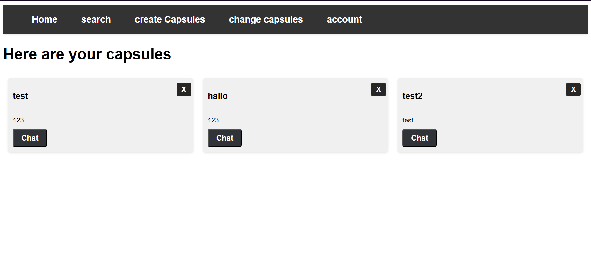

# Projektdokumentation Capsule

## Tag 1 / 07.06.2023

Heute war der Tag, an diesem wir entscheiden durften, welches Projekt wir machem. Ich habe mir am Anfang stark überlegt, was ich machen soll und wie ich es machen soll. Ich bin aber so auf keine Lösung gekommen, weil ich das beste Projekt machen wollte, welches ich kann. Ich habe mich dann entschieden eine Room basierte Chat App zu machen. Ich hatte aber ein Problem, ich wusste nicht wie ich das genau machen soll. Also habe ich mir mal ein paar Beispiele angeschaut und bin dann auf Socket.io gestossen. Also habe ich mich noch für die Backend Sprache Node JS entschieden und so ist mein Projekt entstanden. Ich habe danach noch ein bisschen umexperimentiert, wie ich alles machen soll, bis ich dann ca nach einer Stunde auf mein Konzept gestossen bin. Dann habe ich den Rest des Tages damit verbracht verschiedenste Dinge zu planen. Zum Beispiel habe ich UML Klassendiagramme erstellt und noch viele weitere Dinge. Jetzt bin ich hier und schreibe meine Dokumentation.

## Tag 2 / 08.06.2023

Heute war ein aufregender Tag, denn ich habe heute meien gesammte Planung gemacht und habe mich dann auf den Weg begeben meine Login und andere Datenbank Dinge zu tun. Ich war mit diesen relativ schnell fertig, nachdem ich verstanden habe, dass die Datenbank funktionen Asynchron sind. Nachdem ist eigentlich alles gut gegangen und ich habe weitere Dinge gemacht, wie zum Beispiel mich den Scokets gewibmet. Ich habe heute auch die Datenbank Funktionen geschrieben, welche für das Inserting der Daten kümmern, wenn man eine Capsule / einen Room erstellt. Das habe ich ganz vergessen, ich habe mein Projektname von RoomWave auf Capsule geändert, weil ich den Namen besser fand und ich denke, dass er es auch ist. Ansonsten traten heute keine grösseren Probleme auf. Ich musste zwar manchmal ein paar Dinge repetieren aber dies war es dann auch schon. Ich denke, dass ich noch früher fertig werde als ich geplant habe und das freut mich, denn dann kann ich mich den Nebenaufgaben wibbmen, welche ich mir gestellt habe. Darunter sind einzerlkomunikation zwischen usern und das Allgemeien Design verbessern.

## Tag 3 / 09.06.2023

Heute war ein sehr aufregender und auch spannender Tag, denn ich habe mich endlich um meine Sockets gekümmert, weil ich gestern schon die meisten Dinge von heute fertig gebracht habe und so kam ich heute dazu die Socket connections zu machen. Bis zum jetzigen Stand kann man verschiedenste Dinge machen wie z.B. eine Capsule erstellen oder ihnen joinen. Bis jetzt geschieht dabei aber nur etwas in der Datenbank. Es klingt nach nicht sehr vielen Dingen aber es war für mich kompliziert und aufwendig diese einzubinden. Vorallem musste ich zuerst die Sockets verstehen aber dies ist nicht das Problem hier. Denn eigentlich ist das Prinzip hinter diesen relativ einfach man kann etwas mit socket.emit('function name', { mögliche Parameter }) schicken und dann mit socket.on('name der zu empfangenden Funktion', (data) => {}) schreibt und wenn man data benutzt und man den Parameter von socket.emit eingibt, hat man zugriff auf die Daten. Dies sieht dann in Verwendung so aus:

Ansonsten habe ich auch ganz viele neue Datenbank Funktionen geschrieben, denn die Sockets können ja nicht von alleine in die Datenbank schreiben. Ich hatte heute zum Teil Probleme mit den Values der Datenbank, weil ich die Datenbank Funktionen nicht mit Await entgegengenommen habe, ich habe aber dann ganz schnell herausgefunden wieso und ich konnte gut weiterfahren. Im gesammten kann ich sagen, dass ich heute gut vorangekommen bin und der Tag an sich war sehr spannend und interessant.

## Tag 4 / 14.06.2023

Heute war es dann endlich spannend, denn ich habe mich darum gekümmert, dass man jetzt in den Rooms Chatten kann. Dazu habe ich noch ein paar Bugs behoben, wie z.B. das man redirected wird, wenn man sich versucht einen User zu erstellen und dann es schon jemand mit diesem Usernamen gibt. Ich habe mich auch darum gekümmert, dass einem verschiedenste Dinge auf dem UI angezeigt werden und so habe ich den Tag auch schon Erfolgreich abgeschlossen. Ich habe meine Ziele für den Heutigen Tag erreicht und ich kann aber sagen, dass ich das CSS unbedingt verbessern muss, denn es sieht bis jetzt nicht sehr schön aus und es kann noch einen guten CSS look verdienen. Ansonsten hatte ich heute keine grösseren Probleme, ich habe aber bemerkt, dass ich zwar die Rooms in der Datenbank create aber nicht mit Socket.io also konnte ich nicht wircklich reinschreiben, dass habe ich aber danach gefixxt und jetzt funktioniert alles. Ich habe auch einen neuen API Endpoint Hinzugefügt, damit man auf das Chat UI kommt. Hier ist noch ein Bild, wie mein Chat derzeit aussieht:

## Tag 5 / 15.06.2023

Heute habe ich eigentlich die meiste Zeit damit verbracht mein CSS aufzubessern, damit man die Webseite endlich mal anschauen kann. Dies hat sehr gut funktioniert, denn sie sieht jetzt relativ schön aus. Ich habe dabei auch gelernt, wie man CSS Button Animationen macht und ich muss sagen, dass dies sehr gut funktioniert und auch nicht allzu schwer ist. Ich hatte heute eigentlich keine grösseren Probleme ausser mit CSS, denn CSS macht meistens was es will und ich finde es nicht sehr interessant. Ansonsten lief der Tag sehr gut und ich würde sagen, dass ich auch produktiv war, denn ich habe sehr viel CSS geschrieben. Sonst war der Tag nicht allzu spannend. Ich habe aber auch noch bemerkt, dass ich noch ein paar Bugfixes machen musste, wie z.B. die Login Bugs oder das ein paar Benachrichtigungen nicht durch kamen oder ich sie schlichtweg vergessen habe. Hier sind noch ein Bilder von meinem neuen CSS:

## Tag 6 / 16.06.2023

Heute habe ich daran gearbeitet, verschiedenste Quality of Life Updates gemacht, denn es gab noch ein paar Dinge, welche man überarbeitet werden mussten. Darum habe ich dieses gemacht und dann habe ich mich daran gemacht, zu implementieren, dass man seine Kapseln / Räume verändern kann. Dies bedeutet, dass man den Namen und die Beschreibung des Raumes verändern kann. Ich hatte heute keine größeren Probleme und ich konnte gut an den Themen arbeiten. Hier ist noch ein Bild von der Überabarbeitungs-Seite:

## Tag 7 / 21.06.2023

Heute habe ich verschiedenste kleinere Dinge gemacht, welche ich mir schon länger vorgeschoben habe und so habe ich ein paar Quality of Life Dinge gemacht, wie z.B. dass einem wenn man Capsules sucht nur noch die Capsules angezeigt werden, welchen man noch nicht beigetreten ist. Ich habe auch implementiert, dass man Rooms löschen kann. Ich hatte heute eigentlich keine grösseren Probleme oder Dinge, welche mich grossartig aufgehalten haben. Es war ein durchaus angenehmer Tag und ich konnte die meisten Dinge schon, welche ich heute machen musste. Ich habe auch ein paar Bugs behoben z.B. den Bug, dass man einen Lehren Namen der Capsule geben konnte, wenn man diese geupdated hat. Dann habe ich noch automatisches Scrolling bei den Containern hinzugefügt. hier ist noch ein Bild von dem Geupdateten changeCapsule: 

## Tag 8 / 22.06.2023

Heute habe ich auch wieder wie gestern verschiedenste Dinge gemacht und ein paar Dinge implementiert. Als erstes, habe ich es gemacht, dass man seine Email und sein Passwort ändern kann. Dann habe ich noch ein paar Zusätzliche Dinge gemacht, wie z.B. dass man jetzt auch als User Capsules verlassen kann. Ich habe mich dann auch noch darum gekümmert, dass wenn man eine bestimmte Capsule suchen wollte, dann musste man früher den korrekten Namen eingeben, damit man etwas als Ergebnis bekommt. Auch konnte man nur nach dem Room Namen suchen und nicht nach der Room Beschreibung und so habe ich ein paar Dinge gereworked. Ich habe es jetzt implementiert, dass man nach etwasem suchen kann und dann wird mit einem Like pattern entschieden, was dieses Wort beinhaltet. Auch kann man jetzt nach Room Beschreibungen suchen. Hier sind Bilder, wie das neue Home und das Searching jetzt aussieht:

# Beschreibung der API Endpoints

## /

Hier kann man sich einloggen und man sieht einfach die Login Page.

## /registration

Hier kann man User registrieren.

## /home

Hier sieht man sein eigenes Home also sieht man hier alle seine Capsules, welche man ertellt hat.

## /search

Hier kann man verschiedenste Capsules suchen und diesen auch Joinen, damit man sie auf /home wieder sieht.

## /createCapsule

Hier kann man Capsules erstellen und dann können Leute auf diese Joinen, damit man mit ihnen Chatten kann.

## /logout

Hier kann man sich ausloggen, dann wird einfach der JWT, welcher in einem Cookie gespeichert wird gelöscht und man muss sich zuerst wieder einloggen, damit man etwas wieder machen kann.

## /ip

Hier bekommt man die Aktuelle Server IP, diese wird einfach verwendet, damit die IP nicht auf den Clients hard gecoded ist.

## /account

Hier kann man seine Accountdaten mit einer Post request ändern und man bekommt, wenn man eine Get request macht, das HTML geliefert.

## /changeCapsule

Hier kriegt man wieder mit einer Get request, dass HTML geliefert.

# Inbetriebnahme

Damit man das Programm in Betrieb nehmen kann braucht man eigentlich nur etwas und das ist der Code, welcher auf meinem Github bereitgestellt wird. Nachdem man den Code hat, kann man dann endlich starten und mit `<npm install>` Die Dependencies herunterladen, damit man den Server starten kann. Danach kann man mit `<nodemon index.js>` oder mit `<node index.js>` den Server starten. Dabei ist es wichtig zu wissen, dass der Port 8080 frei sein muss, ansonsten funktioniert es nicht. Nachdem man es gestartet hat, kann man als Host mit `<localhost:8080>` auf den Server zugreifen und wenn man ein Client ist, welcher sich auf den server Connecten will kann man mit `<http://server-ip:8080>`die Server IP kann man mit dem `<ip config>` command herausfinden und so kann man sich dann auch schon unterhalten. Dies geht aber nur im eigenen Subnetz und das Protokoll ist HTTP.
